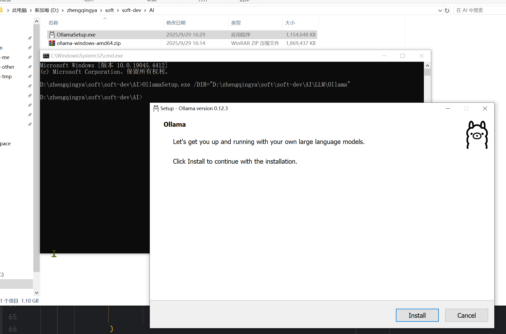
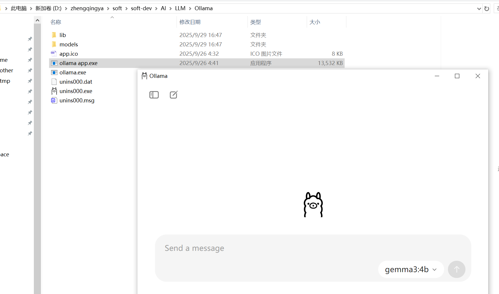
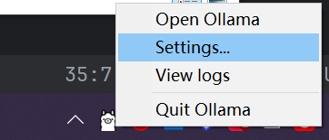
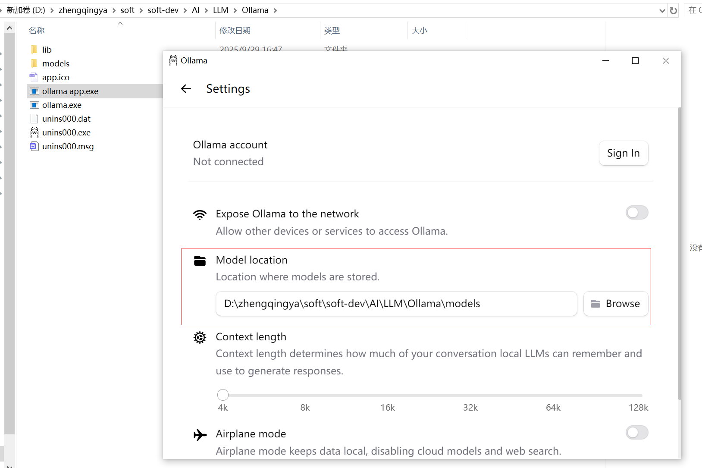
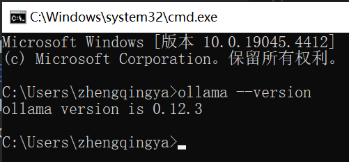
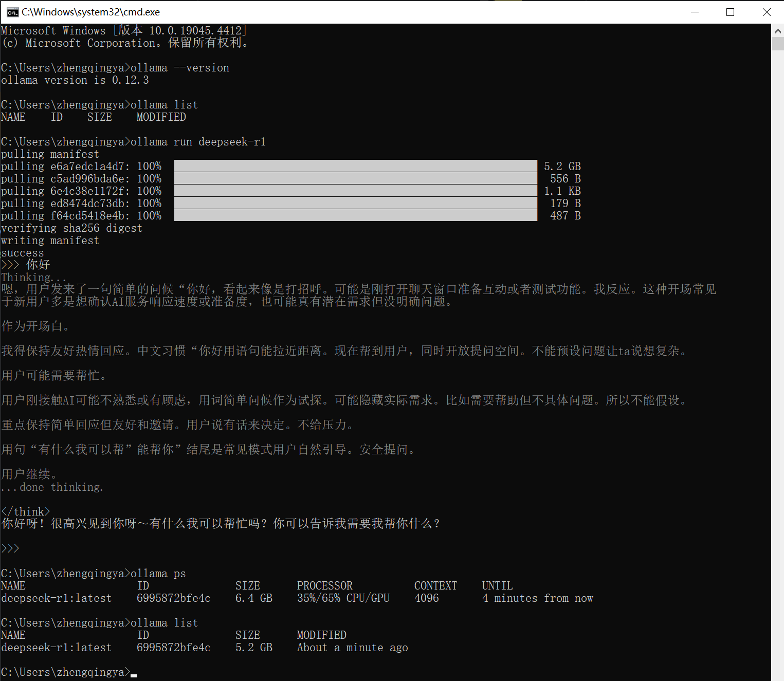

# ollama

https://ollama.com/

`ollama` 是一个用于在本地运行大型语言模型（LLM）的工具和平台。它允许开发者在自己的计算机上轻松地安装、管理和运行各种开源的大语言模型，而无需依赖云端服务。

主要特点包括：

- 支持多种流行的开源大语言模型
- 提供简单的命令行界面进行模型管理
- 可以在本地环境中运行模型，保护数据隐私
- 支持模型的下载、启动、停止和删除等操作
- 默认通过11434端口提供服务

通过 `ollama`，开发者可以方便地在本地开发环境中集成和测试大语言模型功能。

### 一、windows安装

> tips: 国内下载慢，可使用迅雷下载~

下载： https://github.com/ollama/ollama/releases/download/v0.12.3/OllamaSetup.exe

#### 1、环境变量配置

###### 模型文件存储路径

> 默认存储路径： C:\Users\zhengqingya\.ollama\models

`此电脑` -> `属性` -> `高级系统设置` -> `环境变量`

```
# 新建环境变量
OLLAMA_MODELS -> D:\zhengqingya\soft\soft-dev\AI\LLM\Ollama\models
```

#### 2、cmd -> 自定义ollama安装路径

```shell
OllamaSetup.exe /DIR="D:\zhengqingya\soft\soft-dev\AI\LLM\Ollama"
```



安装成功后，运行ollama （双击`ollama app.exe`）


设置中查看模型下载路径



> tips: `OLLAMA_MODELS` 环境变量需要在安装ollama前配置，如果在安装后配置，这里的模型下载路径还是默认路径。

```shell
# 查看版本
ollama --version
```



### 二、模型下载

查看支持的模型 https://ollama.com/search

```shell
# 查看帮助信息
ollama help

# 启动 Ollama 服务  -- 默认端口号：11434
ollama serve

# 列出已下载的模型
ollama list

# 下载指定模型
ollama pull <model_name>

# 运行指定模型 -- 若模型未下载，则先下载
ollama run <model_name>
# ollama run deepseek-r1
# ollama run qwen3:8b

# 停止运行中的模型
ollama stop <model_name>

# 删除已下载的模型
ollama rm <model_name>

# 查看当前运行的模型实例
ollama ps
```



退出对话： `ctrl+d` 或 `\bye`