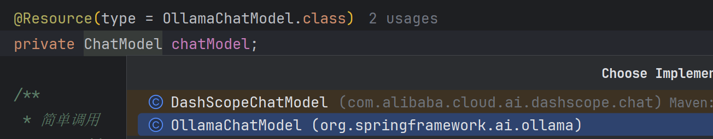

# 接入ollama（本地大模型）

> 前置环境：[02-ollama安装-windows.md](02-ollama安装-windows.md)

### 一、`pom.xml`引入依赖

```
<dependency>
    <groupId>org.springframework.ai</groupId>
    <artifactId>spring-ai-starter-model-ollama</artifactId>
    <version>1.0.0</version>
</dependency>
```

### 二、yaml配置

```yaml
spring:
  ollama:
    base-url: http://localhost:11434
    chat:
      model: deepseek-r1 # qwen3:8b | deepseek-r1
```

### 三、智能对话

[_02_OllamaController.java](../01-quick-start/src/main/java/com/zhengqing/saa/api/_02_OllamaController.java)

```java
import io.swagger.v3.oas.annotations.Operation;
import io.swagger.v3.oas.annotations.tags.Tag;
import jakarta.annotation.Resource;
import lombok.RequiredArgsConstructor;
import org.springframework.ai.chat.model.ChatModel;
import org.springframework.ai.ollama.OllamaChatModel;
import org.springframework.web.bind.annotation.GetMapping;
import org.springframework.web.bind.annotation.RequestMapping;
import org.springframework.web.bind.annotation.RequestParam;
import org.springframework.web.bind.annotation.RestController;
import reactor.core.publisher.Flux;

@RequiredArgsConstructor
@RestController
@RequestMapping("/ollama")
@Tag(name = "02-ollama")
public class _02_OllamaController {

    @Resource(type = OllamaChatModel.class)
    private ChatModel chatModel;

    /**
     * 简单调用
     * http://localhost:888/ollama/simple/chat?msg=你是谁？
     */
    @Operation(summary = "简单调用")
    @GetMapping("/simple/chat")
    public String simpleChat(@RequestParam(defaultValue = "你是谁？") String msg) {
        return chatModel.call(msg);
    }

    /**
     * 流式调用
     * http://localhost:888/ollama/stream/chat?msg=你是谁？
     */
    @Operation(summary = "流式调用")
    @GetMapping("/stream/chat")
    public Flux<String> streamChat(@RequestParam(defaultValue = "你是谁？") String msg) {
        return chatModel.stream(msg);
    }

}
```

引入多个模型之后，需要显式注入指定模型

