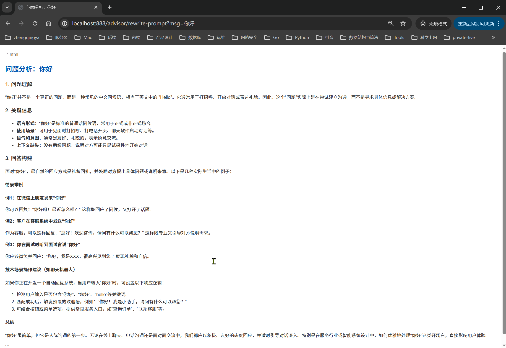

# Advisor对话拦截 -- 自定义拦截器实现重写提示词

作用：使用户输入简单的问题，也能获得经过深度思考和结构化处理的高质量回答。

[_09_AdvisorCustomController.java](../01-quick-start/src/main/java/com/zhengqing/saa/api/_09_AdvisorCustomController.java)

```java
import org.springframework.ai.chat.client.ChatClientRequest;
import org.springframework.ai.chat.client.ChatClientResponse;
import org.springframework.ai.chat.client.advisor.api.AdvisorChain;
import org.springframework.ai.chat.client.advisor.api.BaseAdvisor;
import org.springframework.ai.chat.prompt.Prompt;
import org.springframework.ai.chat.prompt.PromptTemplate;

import java.util.Map;

/**
 * <p> 自定义Advisor拦截器 -- 实现重写提示词 </p>
 *
 * @author zhengqingya
 * @description 请求之前，重写提示词
 * @date 2025/10/2 23:02
 */
public class RewritePromptAdvisor implements BaseAdvisor {

    private static final String REWRITE_TEXT = """
            让我们仔细分析这个问题：
            
            问题: {input_msg}
            
            分析步骤：
            1. 问题理解: 这个问题在问什么？
            2. 关键信息: 有哪些重要的细节需要注意？
            3. 回答构建: 基于以上分析，给出准确详细的回答：
            
            回答要求：
            - 使用通俗易懂的语言
            - 结合实际情况举例说明
            - 如涉及技术内容，提供具体的操作步骤
            - 返回html格式内容
            """;

    @Override
    public ChatClientRequest before(ChatClientRequest chatClientRequest, AdvisorChain advisorChain) {
        String contents = chatClientRequest.prompt().getContents();
        String inputMsg = PromptTemplate.builder().template(REWRITE_TEXT).build()
                .render(Map.of("input_msg", contents));
        return chatClientRequest.mutate()
                .prompt(Prompt.builder().content(inputMsg).build())
                .build();
    }

    @Override
    public ChatClientResponse after(ChatClientResponse chatClientResponse, AdvisorChain advisorChain) {
        return chatClientResponse;
    }

    @Override
    public int getOrder() {
        return 0;
    }
}
```

效果：


