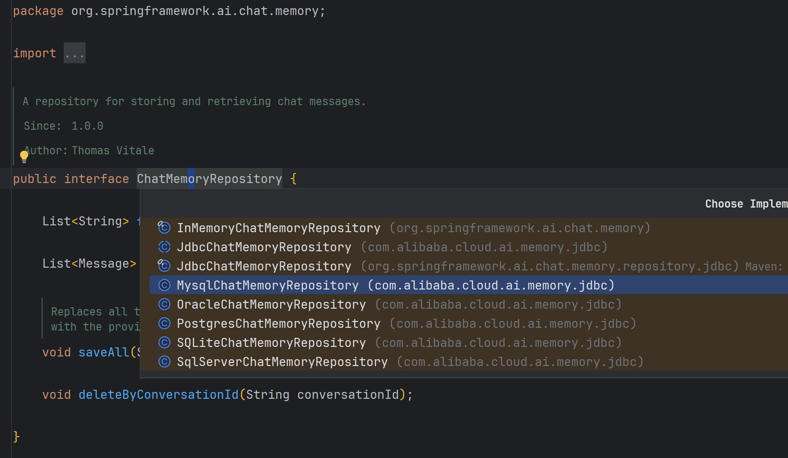
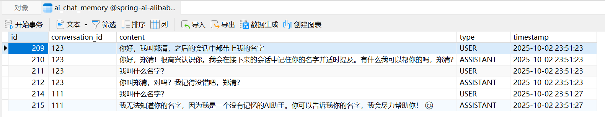

# Chat Memory 对话记忆

用于维护对话上下文状态。



---

### mysql存储示例

#### 1、引入依赖

``` 
<dependency>
    <groupId>com.alibaba.cloud.ai</groupId>
    <artifactId>spring-ai-alibaba-starter-memory-jdbc</artifactId>
    <version>1.0.0.2</version>
</dependency>
<dependency>
    <groupId>mysql</groupId>
    <artifactId>mysql-connector-java</artifactId>
    <version>8.0.32</version>
</dependency>
```

#### 2、yml配置

```yaml
spring:
  datasource:
    driver-class-name: com.mysql.cj.jdbc.Driver
    url: jdbc:mysql://localhost:3306/spring-ai-alibaba-demo?allowMultiQueries=true&useUnicode=true&characterEncoding=UTF8&zeroDateTimeBehavior=convertToNull&useSSL=false # MySQL在高版本需要指明是否进行SSL连接 解决则加上 &useSSL=false
    username: root
    password: root
```

#### 3、代码示例

[_10_ChatMemoryController.java](../01-quick-start/src/main/java/com/zhengqing/saa/api/_10_ChatMemoryController.java)

```java
import com.alibaba.cloud.ai.dashscope.chat.DashScopeChatModel;
import com.alibaba.cloud.ai.dashscope.chat.DashScopeChatOptions;
import com.alibaba.cloud.ai.memory.jdbc.MysqlChatMemoryRepository;
import io.swagger.v3.oas.annotations.tags.Tag;
import jakarta.servlet.http.HttpServletResponse;
import org.springframework.ai.chat.client.ChatClient;
import org.springframework.ai.chat.client.advisor.MessageChatMemoryAdvisor;
import org.springframework.ai.chat.client.advisor.SimpleLoggerAdvisor;
import org.springframework.ai.chat.memory.ChatMemory;
import org.springframework.ai.chat.memory.ChatMemoryRepository;
import org.springframework.ai.chat.memory.MessageWindowChatMemory;
import org.springframework.jdbc.core.JdbcTemplate;
import org.springframework.web.bind.annotation.*;
import reactor.core.publisher.Flux;

@RestController
@RequestMapping("/chat-memory")
@Tag(name = "10-对话记忆")
public class _10_ChatMemoryController {


    private final ChatClient chatClient;

    // 注入 JdbcTemplate, ChatClient
    public _10_ChatMemoryController(JdbcTemplate jdbcTemplate, DashScopeChatModel dashScopeChatModel) {
        // 构造 ChatMemoryRepository 和 ChatMemory
        ChatMemoryRepository chatMemoryRepository = MysqlChatMemoryRepository.mysqlBuilder()
                .jdbcTemplate(jdbcTemplate)
                .build();
        ChatMemory chatMemory = MessageWindowChatMemory.builder()
                .chatMemoryRepository(chatMemoryRepository)
                .maxMessages(10) // 消息存储条数 -- mysql中最多保留消息记录数
                .build();

        this.chatClient = ChatClient.builder(dashScopeChatModel)
                // 增加聊天记忆能力
                .defaultAdvisors(MessageChatMemoryAdvisor.builder(chatMemory).build())
                // 实现 Logger 的 Advisor
                .defaultAdvisors(new SimpleLoggerAdvisor())
                // 设置 ChatClient 中 ChatModel 的 Options 参数
                .defaultOptions(DashScopeChatOptions.builder().withTopP(0.7).build())
                .build();
    }

    /**
     * 使用自定义的 Advisor 增加聊天记忆能力
     * eg:
     * http://127.0.0.1:888/chat-memory/chat/123?msg=你好，我叫郑清，之后的会话中都带上我的名字
     * 你好，郑清！很高兴认识你～接下来的对话我都会记得你的名字的。有什么想聊的或者需要帮忙的，尽管告诉我吧，郑清！ 😊
     * http://127.0.0.1:888/chat-memory/chat/123?msg=我叫什么名字？
     * 你叫郑清，我一直都记得呢，郑清！😊
     * http://127.0.0.1:888/chat-memory/chat/111?msg=我叫什么名字？
     * 抱歉，我无法知道你的名字。你可以告诉我你的名字吗？😊
     */
    @GetMapping("/chat/{id}")
    public Flux<String> advisorChat(HttpServletResponse response, @PathVariable String id, @RequestParam String msg) {
        response.setCharacterEncoding("UTF-8");
        return this.chatClient.prompt(msg)
                .advisors(
                        a -> a
                                .param(ChatMemory.CONVERSATION_ID, id) // 多用户记忆隔离
//                                .param(CHAT_MEMORY_RETRIEVE_SIZE_KEY, 100)
                ).stream().content();
    }

}
```

#### 4、运行测试

启动项目后，mysql中会自动创建如下表

```mysql
CREATE TABLE `ai_chat_memory`
(
    `id`              bigint(20)   NOT NULL AUTO_INCREMENT,
    `conversation_id` varchar(256) NOT NULL,
    `content`         longtext     NOT NULL,
    `type`            varchar(100) NOT NULL,
    `timestamp`       timestamp    NOT NULL DEFAULT CURRENT_TIMESTAMP ON UPDATE CURRENT_TIMESTAMP,
    PRIMARY KEY (`id`)
) ENGINE = InnoDB
  AUTO_INCREMENT = 182
  DEFAULT CHARSET = utf8mb4;
```

请求接口

- http://127.0.0.1:888/chat-memory/chat/123?msg=你好，我叫郑清，之后的会话中都带上我的名字
- http://127.0.0.1:888/chat-memory/chat/123?msg=我叫什么名字？
- http://127.0.0.1:888/chat-memory/chat/111?msg=我叫什么名字？

db存储结果：


