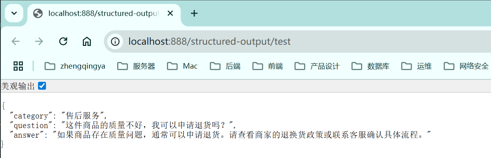

# 结构化输出

将模型的输出转换为特定的数据结构。

### 代码示例

```java
public record StructuredVO(String category, String question, String answer) {
}
```

[_11_StructuredOutputController.java](../01-quick-start/src/main/java/com/zhengqing/saa/api/_11_StructuredOutputController.java)

```java
import com.alibaba.cloud.ai.dashscope.chat.DashScopeChatModel;
import com.zhengqing.saa.model.vo.StructuredVO;
import io.swagger.v3.oas.annotations.tags.Tag;
import org.springframework.ai.chat.client.ChatClient;
import org.springframework.web.bind.annotation.GetMapping;
import org.springframework.web.bind.annotation.RequestMapping;
import org.springframework.web.bind.annotation.RestController;

@RestController
@RequestMapping("/structured-output")
@Tag(name = "11-结构化输出")
public class _11_StructuredOutputController {

    private ChatClient chatClient;

    public _11_StructuredOutputController(DashScopeChatModel dashScopeChatModel) {
        chatClient = ChatClient.builder(dashScopeChatModel).build();
    }

    /**
     * http://localhost:888/structured-output/test
     * {"category":"售后服务","question":"这件商品的质量不好，我可以申请退货吗？","answer":"如果商品存在质量问题，通常可以申请退货。请查看商家的退换货政策或联系客服确认具体流程。"}
     */
    @GetMapping("/test")
    public StructuredVO structuredOutput() {
        return chatClient.prompt()
                .system("""
                        对问题分类并简要总结，并给出答案
                        """)
                .user("这件商品的质量不好，我可以申请退货吗？")
                .call().entity(StructuredVO.class);
    }

}
```

效果

