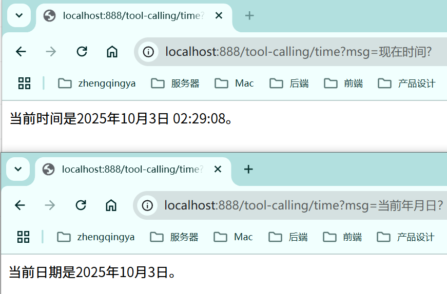
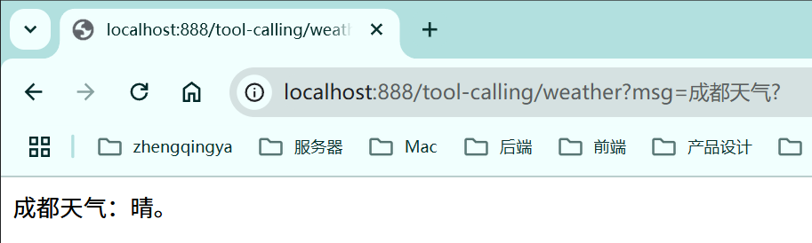

# 工具调用（Tool Calling、Function Call）

> 可参考：https://java2ai.com/docs/1.0.0.2/tutorials/basics/tool-calling/

允许AI模型调用外部工具和函数来执行特定任务。

---

### 示例

- 问题：在默认情况下，大模型不能回复实时时间，天气预报等。

- 需求1：定义一个获取当前时间的工具，提供给大模型输出实时时间。
- 需求2：定义一个获取天气的工具，提供给大模型输出指定城市天气。

#### 1、定义工具

###### 法1：方法工具

Spring AI 可以定义类的某个方法为工具，在方法上标记 @Tool 注解，在参数上标记 @ToolParam 注解。
在调用 ChatClient 时，通过 `.tools()` 方法传递工具对象，或者在实例化 ChatClient 对象的时候通过 `.defalutTools()` 方法传递工具对象

[TimeTools.java](../01-quick-start/src/main/java/com/zhengqing/saa/tools/TimeTools.java)

```java
import cn.hutool.core.date.DateUtil;
import lombok.extern.slf4j.Slf4j;
import org.springframework.ai.tool.annotation.Tool;
import org.springframework.ai.tool.annotation.ToolParam;
import org.springframework.stereotype.Service;

@Slf4j
@Service
public class TimeTools {

    // returnDirect: true:直接返回工具结果 false:传递回大模型，由大模型处理最终响应结果。
    @Tool(description = "获取当前时间，默认时间格式：YYYY-MM-DD HH:mm:ss")
    public String getCurrentTime(@ToolParam(description = "时间格式") String format) {
        log.info("获取当前时间格式：{}", format);
        return DateUtil.now();
    }

}
```

###### 法2：函数工具

开发者可以把任意实现 Function 接口的对象，定义为 Bean ，并通过 `.toolNames()` 或 `.defaultToolNames()` 传递给 ChatClient 对象。

[WeatherFunction.java](../01-quick-start/src/main/java/com/zhengqing/saa/tools/WeatherFunction.java)

```java
import com.fasterxml.jackson.annotation.JsonPropertyDescription;
import lombok.extern.slf4j.Slf4j;
import org.springframework.context.annotation.Description;
import org.springframework.stereotype.Service;

import java.util.function.Function;

@Slf4j
@Service(value = "getWeather")
public class WeatherFunction implements Function<String, String> {

    @Override
    @Description("获取天气")
    public String apply(@JsonPropertyDescription("城市") String city) {
        log.info("获取{}天气", city);
        return city + "天气：晴";
    }

}
```

#### 2、注册工具 & 调用

[_12_ToolCallingController.java](../01-quick-start/src/main/java/com/zhengqing/saa/api/_12_ToolCallingController.java)

```java
import com.alibaba.cloud.ai.dashscope.chat.DashScopeChatModel;
import com.zhengqing.saa.tools.TimeTools;
import io.swagger.v3.oas.annotations.tags.Tag;
import org.springframework.ai.chat.client.ChatClient;
import org.springframework.beans.factory.annotation.Autowired;
import org.springframework.web.bind.annotation.GetMapping;
import org.springframework.web.bind.annotation.RequestMapping;
import org.springframework.web.bind.annotation.RequestParam;
import org.springframework.web.bind.annotation.RestController;
import reactor.core.publisher.Flux;

@RestController
@RequestMapping("/tool-calling")
@Tag(name = "12-工具调用")
public class _12_ToolCallingController {

    private ChatClient chatClient;
    @Autowired
    private TimeTools timeTools;

    public _12_ToolCallingController(DashScopeChatModel dashScopeChatModel) {
        chatClient = ChatClient.builder(dashScopeChatModel)
                // 全局注册工具
//                .defaultTools(timeTools)
//                .defaultToolNames("getWeather")
                .build();
    }

    /**
     * 法1：方法工具
     * http://localhost:888/tool-calling/time?msg=现在时间?
     * 现在的时间是2025年10月3日02点35分52秒。
     * <p>
     * http://localhost:888/tool-calling/time?msg=当前年月日？
     * 当前日期是2025年10月3日。
     */
    @GetMapping("/time")
    public Flux<String> time(@RequestParam String msg) {
        return chatClient.prompt().user(msg)
                .tools(timeTools)
                .stream().content();
    }

    /**
     * 法2：函数工具
     * http://localhost:888/tool-calling/weather?msg=成都天气?
     * 现在的时间是2025年10月3日02点35分52秒。
     */
    @GetMapping("/weather")
    public Flux<String> weather(@RequestParam String msg) {
        return chatClient.prompt().user(msg)
                .toolNames(new String[]{"getWeather"})
                .stream().content();
    }

}
```



