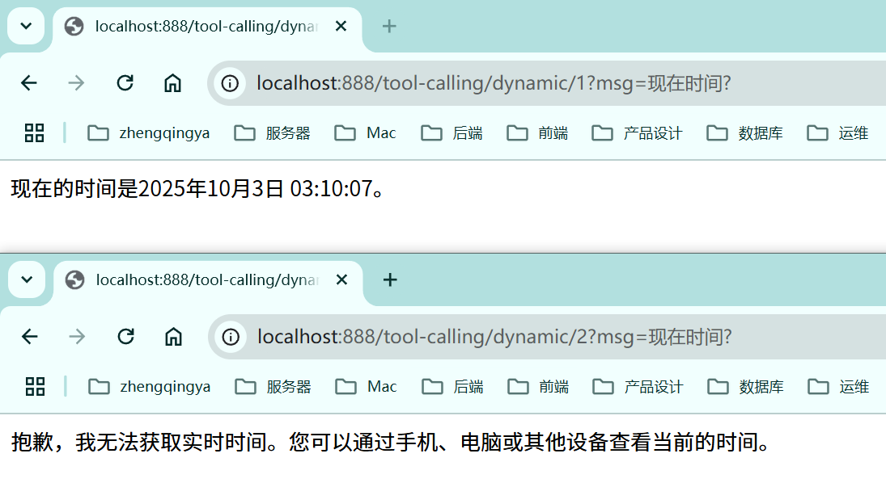
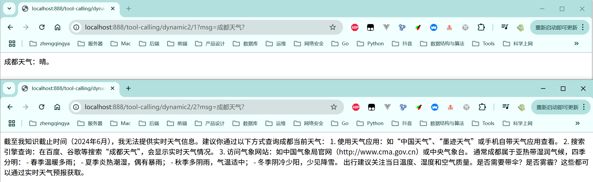

# Tool工具调用-动态注册

> 可参考：https://java2ai.com/docs/1.0.0.2/tutorials/basics/tool-calling/

在上一节 [14-Tool工具调用.md](14-Tool工具调用.md)
注册工具是固定的，每个人有权限调用。

需求：只能调用自己绑定的有权限的工具，实现动态注册工具。

解决：

- 方法1： 直接定义 FunctionToolCallBack 对象，在调用 ChatClient 时通过 `.toolCallBacks()` 传递 FunctionToolCallBack 对象。
- 方法2： 将任意实现 Function 接口的对象，定义为 Bean ，并通过 `.toolNames()` 传递给 ChatClient 对象。

---

### 示例代码

[_13_ToolCallingDynamicController.java](../01-quick-start/src/main/java/com/zhengqing/saa/api/_13_ToolCallingDynamicController.java)

```java
import com.alibaba.cloud.ai.dashscope.chat.DashScopeChatModel;
import com.google.common.collect.Lists;
import com.zhengqing.saa.tools.TimeTools;
import io.swagger.v3.oas.annotations.tags.Tag;
import org.springframework.ai.chat.client.ChatClient;
import org.springframework.ai.tool.ToolCallback;
import org.springframework.ai.tool.definition.ToolDefinition;
import org.springframework.ai.tool.method.MethodToolCallback;
import org.springframework.ai.util.json.schema.JsonSchemaGenerator;
import org.springframework.beans.factory.annotation.Autowired;
import org.springframework.util.ReflectionUtils;
import org.springframework.web.bind.annotation.*;
import reactor.core.publisher.Flux;

import java.lang.reflect.Method;
import java.util.List;

@RestController
@RequestMapping("/tool-calling")
@Tag(name = "13-工具调用-动态注册")
public class _13_ToolCallingDynamicController {

    private ChatClient chatClient;
    @Autowired
    private TimeTools timeTools;

    public _13_ToolCallingDynamicController(DashScopeChatModel dashScopeChatModel,
                                            TimeTools timeTools) {
        chatClient = ChatClient.builder(dashScopeChatModel)
                // 全局注册工具
//                .defaultTools(timeTools)
//                .defaultToolNames("getWeather")
                .build();
    }

    /**
     * 法一：方法工具
     * http://localhost:888/tool-calling/dynamic/1?msg=现在时间?
     * 现在的时间是2025年10月3日 03:10:07。
     * <p>
     * http://localhost:888/tool-calling/dynamic/2?msg=现在时间?
     * 抱歉，我无法获取实时时间。您可以通过手机、电脑或其他设备查看当前的时间。
     */
    @GetMapping("/dynamic/{userId}")
    public Flux<String> dynamic(@PathVariable Long userId, @RequestParam String msg) {
        return chatClient.prompt().user(msg)
                // 动态注册工具
                .toolCallbacks(getToolCallbacks(userId))
                .stream().content();
    }

    private List<ToolCallback> getToolCallbacks(Long userId) {
        List<ToolCallback> toolCallbacks = Lists.newArrayList();
        if (userId != 1) {
            return toolCallbacks;
        }
        Method method = ReflectionUtils.findMethod(TimeTools.class, "getCurrentTime", String.class);
        if (method == null) {
            throw new RuntimeException("Method not found");
        }
        /**
         * 如果原方法的参数没有 @ToolParam 或者 @JsonPropertyDescription 注解，则会缺失参数的 description 字段，因此建议可以用该方法生成一个模板，然后填充参数的 description 字段。
         * eg:
         * {
         *   "$schema" : "https://json-schema.org/draft/2020-12/schema",
         *   "type" : "object",
         *   "properties" : {
         *     "format" : {
         *       "type" : "string",
         *       "description" : "时间格式"
         *     }
         *   },
         *   "required" : [ "format" ],
         *   "additionalProperties" : false
         * }
         */
        String inputSchema = JsonSchemaGenerator.generateForMethodInput(method);
        ToolCallback timeToolCallback = MethodToolCallback.builder()
                .toolDefinition(ToolDefinition.builder()
                        .name("getCurrentTime")
                        .description("获取当前时间，默认时间格式：YYYY-MM-DD HH:mm:ss")
                        .inputSchema(inputSchema)
                        .build())
                .toolMethod(method)
                .toolObject(timeTools)
                .build();
        toolCallbacks.add(timeToolCallback);
        return toolCallbacks;
    }

    /**
     * 法二：函数工具
     * http://localhost:888/tool-calling/dynamic2/1?msg=成都天气?
     * 现在时间是2025年10月03日03时。
     * <p>
     * http://localhost:888/tool-calling/dynamic2/2?msg=成都天气?
     * 抱歉，我无法获取实时时间。您可以通过手机、电脑或其他设备查看当前的时间。
     */
    @GetMapping("/dynamic2/{userId}")
    public Flux<String> dynamic2(@PathVariable Long userId, @RequestParam String msg) {
        String[] toolNames = userId == 1 ? new String[]{"getWeather"} : new String[0];
        return chatClient.prompt().user(msg)
                // 动态注册工具
                .toolNames(toolNames)
                .stream().content();
    }

}
```

效果：


