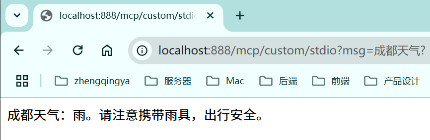

# 自定义MCP服务 -- STDIO

> 可参考：https://java2ai.com/docs/1.0.0.2/practices/mcp/spring-ai-mcp-starter-server/

### 一、服务端实现 -- 新建模块 [02-mcp-server-stdio](../02-mcp-server-stdio)

#### 1、引入依赖

```
<dependency>
    <groupId>org.springframework.ai</groupId>
    <artifactId>spring-ai-starter-mcp-server-webflux</artifactId>
</dependency>
```

#### 2、yaml配置MCP服务端

```yaml
spring:
  main:
    web-application-type: none # 设置为非 Web 应用类型，因为 STDIO 通信不需要 Web 服务器
    banner-mode: off # 关闭 Spring Boot 启动 Banner 输出
  ai:
    # MCP 服务器配置
    mcp:
      server:
        stdio: true # 启用stdio模式
        name: my-weather-server # 服务名称
        version: 1.0.0   # 服务版本
```

#### 3、实现 MCP 工具

```java
import org.springframework.ai.tool.annotation.Tool;
import org.springframework.ai.tool.annotation.ToolParam;
import org.springframework.stereotype.Service;

@Service
public class MyWeatherService {

    @Tool(description = "获取天气")
    public String getWeather(@ToolParam(description = "城市") String city) {
        // 模拟数据，实际应用中应调用真实API
        return city + "天气：雨";
    }

}
```

#### 4、注册 MCP 工具

```java

@Bean
public ToolCallbackProvider weatherTools(MyWeatherService myWeatherService) {
    // 注册 MCP 工具
    return MethodToolCallbackProvider.builder()
            .toolObjects(myWeatherService)
            .build();
}
```

### 二、客户端接入自定义MCP服务

#### 1、mcp服务配置

[application-ai-mcp.yml](../01-quick-start/src/main/resources/application-ai-mcp.yml)

```yaml
spring:
  ai:
    mcp:
      client:
        stdio:
          # 方式1：配置文件
          servers-configuration: classpath:/mcp/mcp-servers-config.json

          # 方式2：直接配置
          connections:
            my-weather-server:
              command: java
              args:
                - -Dspring.ai.mcp.server.stdio=true
                - -Dspring.main.web-application-type=none
                - -Dlogging.pattern.console=
                - -jar
                - D:\zhengqingya\code\workspace-me\java-workspace\ai-project\spring-ai-alibaba-demo\02-mcp-server-stdio\target\02-mcp-server-stdio.jar  # 放一个绝对路径，修改为server jar包所在位置
```

[mcp-servers-config.json](../01-quick-start/src/main/resources/mcp/mcp-servers-config.json)

```json
{
  "mcpServers": {
    "my-weather-server": {
      "command": "java",
      "args": [
        "-Dspring.ai.mcp.server.stdio=true",
        "-Dspring.main.web-application-type=none",
        "-Dlogging.pattern.console=",
        "-jar",
        "D:\\zhengqingya\\code\\workspace-me\\java-workspace\\ai-project\\spring-ai-alibaba-demo\\02-mcp-server-stdio\\target\\02-mcp-server-stdio.jar"
      ]
    }
  }
}
```

#### 2、测试代码

[_15_McpCustomStdioController.java](../01-quick-start/src/main/java/com/zhengqing/saa/api/_15_McpCustomStdioController.java)

```java
import com.alibaba.cloud.ai.dashscope.chat.DashScopeChatModel;
import io.swagger.v3.oas.annotations.tags.Tag;
import org.springframework.ai.chat.client.ChatClient;
import org.springframework.ai.tool.ToolCallbackProvider;
import org.springframework.web.bind.annotation.GetMapping;
import org.springframework.web.bind.annotation.RequestMapping;
import org.springframework.web.bind.annotation.RequestParam;
import org.springframework.web.bind.annotation.RestController;
import reactor.core.publisher.Flux;

@RestController
@RequestMapping("/mcp/custom")
@Tag(name = "15-MCP-自定义mcp服务--STDIO")
public class _15_McpCustomStdioController {

    private ChatClient chatClient;

    public _15_McpCustomStdioController(DashScopeChatModel dashScopeChatModel,
                                        ToolCallbackProvider tools) {
        chatClient = ChatClient.builder(dashScopeChatModel)
                .defaultToolCallbacks(tools) // 注入MCP工具
                .build();
    }


    /**
     * http://localhost:888/mcp/custom/stdio?msg=成都天气?
     */
    @GetMapping("/stdio")
    public Flux<String> stdio(@RequestParam String msg) {
        return chatClient.prompt().user(msg)
                .stream().content();
    }

}
```

效果：

