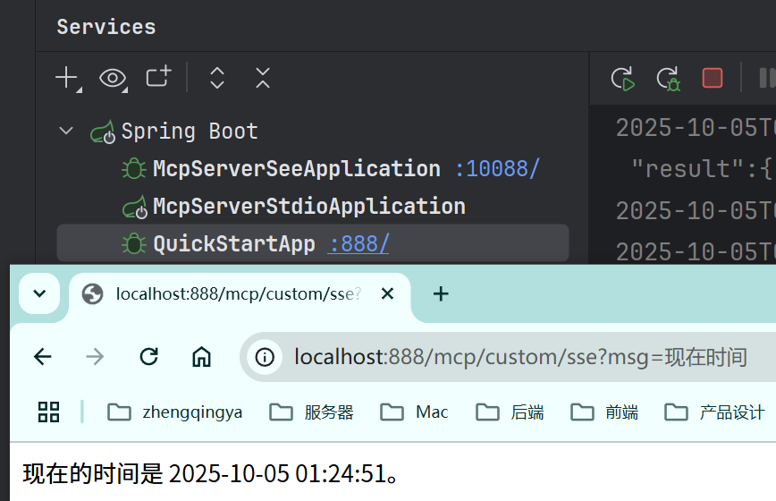

# 自定义MCP服务 -- SSE

> 可参考：
> - https://java2ai.com/docs/1.0.0.2/practices/mcp/spring-ai-mcp-starter-server/
> - https://docs.spring.io/spring-ai/reference/api/mcp/mcp-server-boot-starter-docs.html#_webflux_server_configuration

### 一、服务端实现 -- 新建模块 [03-mcp-server-sse](../03-mcp-server-sse)

#### 1、引入依赖

```
<dependency>
    <groupId>org.springframework</groupId>
    <artifactId>spring-web</artifactId>
</dependency>

<dependency>
    <groupId>org.springframework.ai</groupId>
    <artifactId>spring-ai-starter-mcp-server-webflux</artifactId>
</dependency>
```

#### 2、yaml配置MCP服务端

```yaml
server:
  port: 10088
  servlet:
    encoding:
      enabled: true
      charset: utf-8
      force: true

# 配置参考 https://docs.spring.io/spring-ai/reference/api/mcp/mcp-server-boot-starter-docs.html#_webflux_server_configuration
spring:
  main:
    banner-mode: off
  ai:
    # MCP 服务器配置
    mcp:
      server:
        name: my-sse-server # 服务名称
        version: 1.0.0   # 服务版本
        type: ASYNC  # Recommended for reactive applications
        # 配置 sse 的根路径，默认值为 /sse
        # 下面的最终路径为 ip:port/sse/mcp
        sse-endpoint: /sse
        sse-message-endpoint: /mcp
        capabilities:
          tool: true
          resource: true
          prompt: true
          completion: true
```

#### 3、实现 MCP 工具

```java
import cn.hutool.core.date.DateUtil;
import org.springframework.ai.tool.annotation.Tool;
import org.springframework.stereotype.Service;

@Service
public class TimeToolService {

    @Tool(description = "获取时间")
    public String getTime() {
        return DateUtil.now();
    }

}
```

#### 4、注册 MCP 工具

```java
// 注册 MCP 工具
@Bean
public ToolCallbackProvider timeTools(TimeToolService timeToolService) {
    return MethodToolCallbackProvider.builder()
            .toolObjects(timeToolService)
            .build();
}
```

### 二、客户端接入自定义MCP服务

#### 1、mcp服务配置

[application-ai-mcp.yml](../01-quick-start/src/main/resources/application-ai-mcp.yml)

```yaml
spring:
  ai:
    mcp:
      client:
        sse:
          connections:
            my-sse-server:
              url: http://localhost:10088
```

#### 2、测试代码

[_16_McpCustomSseController.java](../01-quick-start/src/main/java/com/zhengqing/saa/api/_16_McpCustomSseController.java)

```java
import com.alibaba.cloud.ai.dashscope.chat.DashScopeChatModel;
import io.swagger.v3.oas.annotations.tags.Tag;
import org.springframework.ai.chat.client.ChatClient;
import org.springframework.ai.tool.ToolCallbackProvider;
import org.springframework.web.bind.annotation.GetMapping;
import org.springframework.web.bind.annotation.RequestMapping;
import org.springframework.web.bind.annotation.RequestParam;
import org.springframework.web.bind.annotation.RestController;
import reactor.core.publisher.Flux;

@RestController
@RequestMapping("/mcp/custom")
@Tag(name = "16-MCP-自定义mcp服务--SSE")
public class _16_McpCustomSseController {

    private ChatClient chatClient;

    public _16_McpCustomSseController(DashScopeChatModel dashScopeChatModel,
                                      ToolCallbackProvider tools) {
        chatClient = ChatClient.builder(dashScopeChatModel)
                .defaultToolCallbacks(tools) // 注入MCP工具
                .build();
    }


    /**
     * http://localhost:888/mcp/custom/sse?msg=现在时间?
     */
    @GetMapping("/sse")
    public Flux<String> sse(@RequestParam String msg) {
        return chatClient.prompt().user(msg)
                .stream().content();
    }

}
```

效果：


