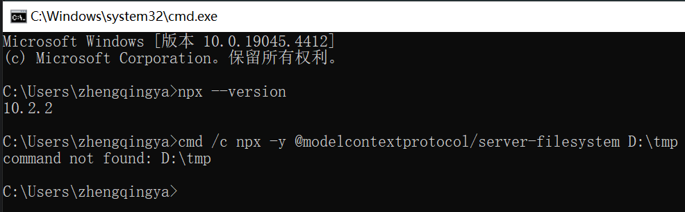
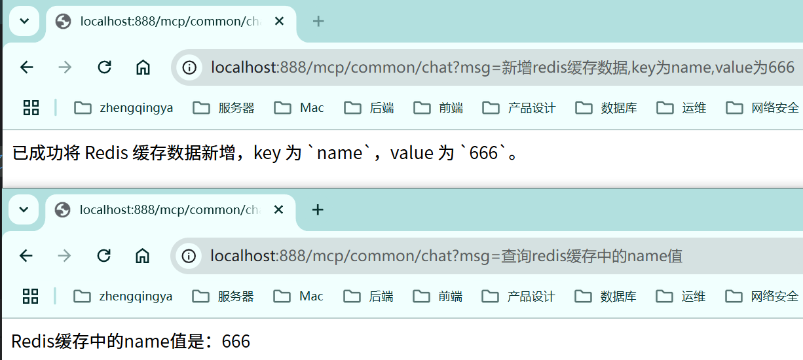

### 接入外部通用MCP

- [MCP Server 工具与插件](https://mcp.so/zh)
- https://springdoc.tech/spring-ai/api/mcp/mcp-client-boot-starter-docs

需求：

1. 通过 `@modelcontextprotocol/server-filesystem` 包，将本地目录作为文件系统服务端。客户端通过 stdio 与之通信。
2. 通过 `mcp/redis` 操作redis缓存数据。客户端通过 stdio 与之通信。

#### 1、引入依赖

```
<dependency>
    <groupId>org.springframework.ai</groupId>
    <artifactId>spring-ai-starter-mcp-client-webflux</artifactId>
</dependency>
```

#### 2、mcp配置

```yaml
spring:
  ai:
    mcp:
      client:
        request-timeout: 60s
        stdio:
          servers-configuration: classpath:/mcp/mcp-servers-config.json
```

[mcp-servers-config.json](../01-quick-start/src/main/resources/mcp/mcp-servers-config.json)

###### server-filesystem -- 失败！！！

https://github.com/modelcontextprotocol/servers/blob/main/src/filesystem/README.md

下面这个配置，基于windows环境

```json
{
  "mcpServers": {
    "filesystem": {
      "command": "cmd",
      "args": [
        "/c",
        "npx",
        "-y",
        "@modelcontextprotocol/server-filesystem",
        "D:\\tmp"
      ]
    }
  }
}
```

单独测试MCP服务器（在终端中手动执行配置的命令，看是否能启动服务器）

```shell
cmd /c npx -y @modelcontextprotocol/server-filesystem D:\tmp
```



###### redis -- 成功

https://mcp.so/zh/server/redis/modelcontextprotocol

> tips: 如果`mcp/redis`镜像下载慢，可以使用`registry.cn-hangzhou.aliyuncs.com/zhengqing/redis-mcp:latest`

```json
{
  "mcpServers": {
    "redis": {
      "command": "docker",
      "args": [
        "run",
        "-i",
        "--rm",
        "--name",
        "redis-mcp",
        "-e",
        "REDIS_HOST=host.docker.internal",
        "-e",
        "REDIS_PORT=6379",
        "-e",
        "REDIS_PWD=123456",
        "mcp/redis"
      ]
    }
  }
}
```

tips: 网上给的文档不全，我是如何查看配置连接参数的？

```shell
docker exec -it redis-mcp cat src/main.py
```

#### 3、代码实现

[_17_McpCommonController.java](../01-quick-start/src/main/java/com/zhengqing/saa/api/_17_McpCommonController.java)

```java
import com.alibaba.cloud.ai.dashscope.chat.DashScopeChatModel;
import io.swagger.v3.oas.annotations.tags.Tag;
import org.springframework.ai.chat.client.ChatClient;
import org.springframework.ai.tool.ToolCallbackProvider;
import org.springframework.web.bind.annotation.GetMapping;
import org.springframework.web.bind.annotation.RequestMapping;
import org.springframework.web.bind.annotation.RequestParam;
import org.springframework.web.bind.annotation.RestController;
import reactor.core.publisher.Flux;

@RestController
@RequestMapping("/mcp/common")
@Tag(name = "17-MCP-外部通用mcp")
public class _17_McpCommonController {

    private ChatClient chatClient;

    public _17_McpCommonController(DashScopeChatModel dashScopeChatModel,
                                   ToolCallbackProvider tools) {
        chatClient = ChatClient.builder(dashScopeChatModel)
                .defaultToolCallbacks(tools) // 注入MCP工具
                .build();
    }


    /**
     * http://localhost:888/mcp/common/chat?msg=新增redis缓存数据,key为name,value为666
     * http://localhost:888/mcp/common/chat?msg=查询redis缓存中的name值
     */
    @GetMapping("/chat")
    public Flux<String> chat(@RequestParam String msg) {
        return chatClient.prompt().user(msg)
                .stream().content();
    }

}
```

效果：

