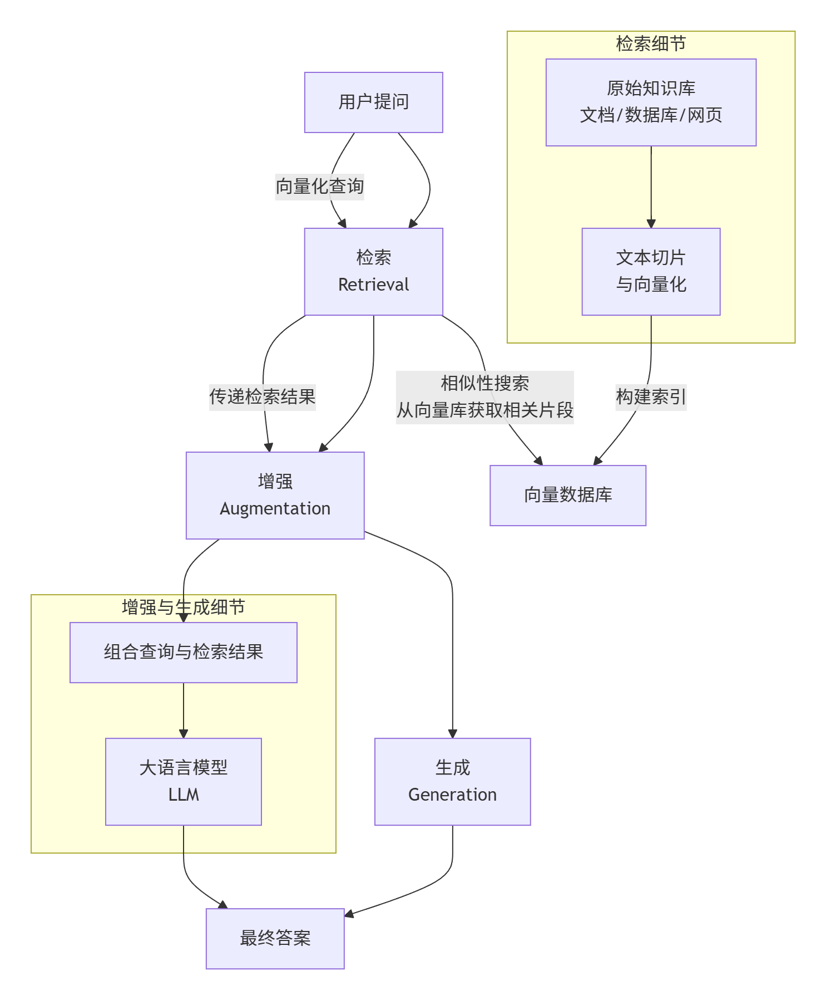
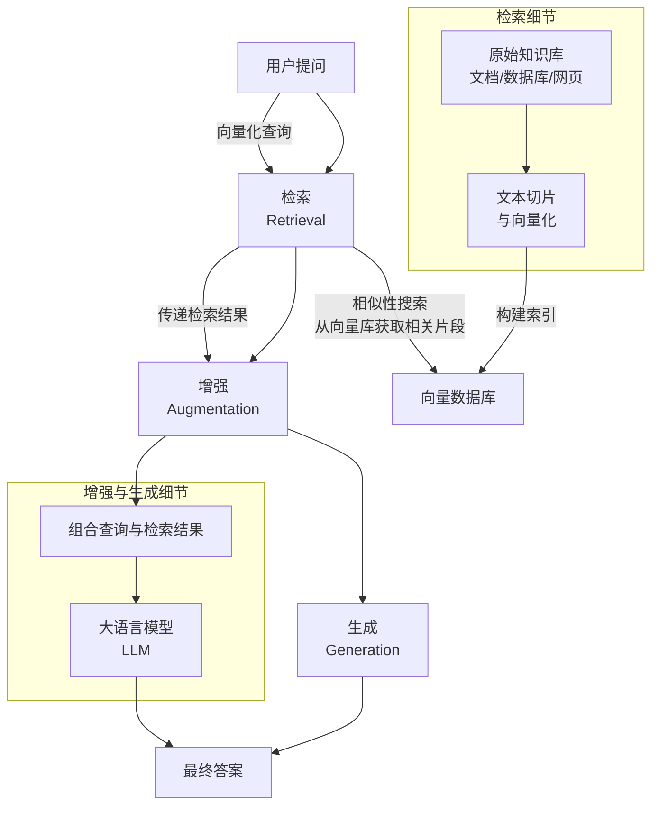
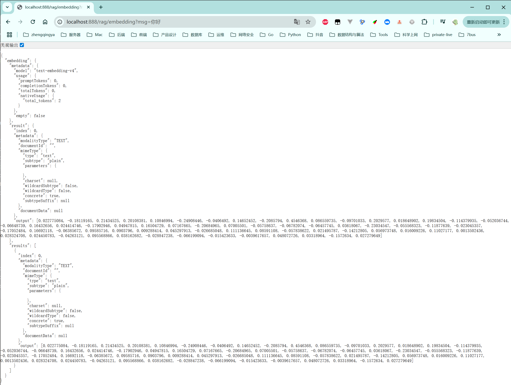
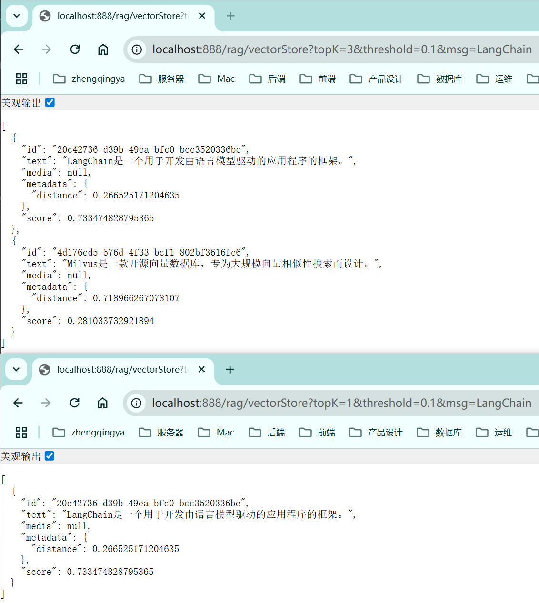
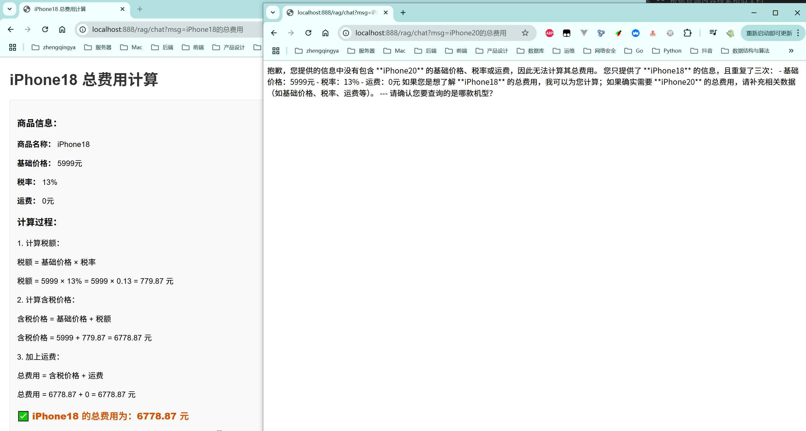
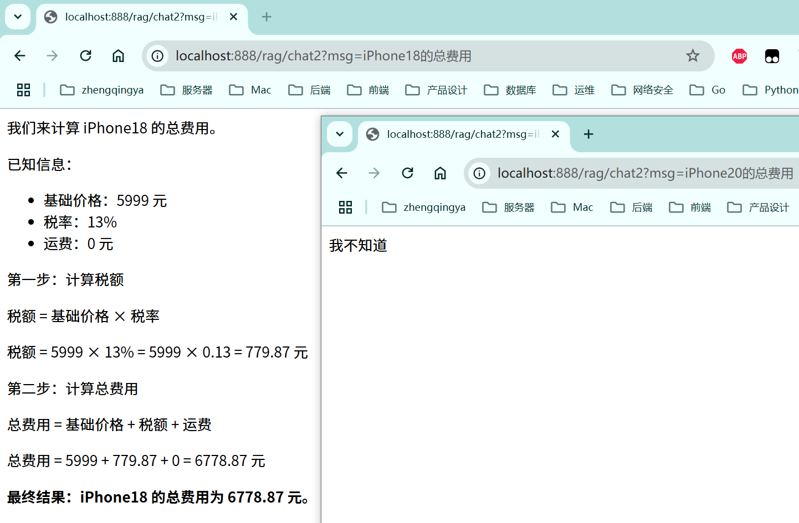

# RAG

RAG (Retrieval-Augmented Generation) 是一种结合检索和生成的技术架构，主要用于增强大语言模型的能力。
简单来说，它通过引入一个“外接知识库”，让模型在回答问题前先查阅权威、最新的资料，从而生成更准确、更有依据的答案。

### 一、🔄RAG的工作流程





1. 检索：当用户提出一个问题时，系统首先将问题转化为向量（一种数学表示），然后在一个预先构建好的向量数据库中进行相似性搜索，找出与问题最相关的信息片段
   。这个数据库存储了外部知识（如企业文档、最新新闻等）经过处理后的向量。
2. 增强：将检索到的相关信息片段与用户的原始问题组合在一起，形成一个内容丰富、上下文清晰的“增强版”提示词
   。例如：“请根据以下资料：{检索到的信息}，来回答这个问题：{用户原问题}。”
3. 生成：将这个增强后的提示词输入给大语言模型。模型会基于你提供的具体资料来生成答案，而不是仅依赖其内部记忆 。

### 二、💡RAG的典型应用场景

- 智能客服与问答系统：为企业提供能准确回答关于产品、政策等问题的客服机器人，知识库可随时更新。
- 企业知识管理：构建企业专属知识中枢，员工可用自然语言查询公司制度、项目文档等，快速获取所需信息。
- 专业领域咨询：在医疗、法律、金融等领域，结合最新的专业文献、法规条文，为专业人士提供辅助决策支持，同时确保答案有据可查。
- 内容创作与研究辅助：帮助作者或研究人员快速从海量资料中查找相关信息，生成内容翔实的报告或文章草稿。

---

### 三、嵌入模型 (Embedding Model)

嵌入(Embedding)的工作原理是将文本、图像和视频转换为称为向量（Vectors）的浮点数数组。
这些向量旨在捕捉文本、图像和视频的含义。嵌入数组的长度称为向量的维度（Dimensionality）。
嵌入模型（EmbeddingModel）是嵌入过程中采用的模型。

#### 文本向量化 案例

需求：通过文本向量化模型，将输入的文本转换为向量。

[application-ai-rag.yml](../01-quick-start/src/main/resources/application-ai-rag.yml)

```yaml
spring:
  ai:
    dashscope:
      embedding:
        options:
          model: text-embedding-v4
          dimensions: 64 # value shold be in [64, 128, 256, 512, 768, 1024, 1536, 2048, 3072]
```

```java
import com.alibaba.cloud.ai.dashscope.embedding.DashScopeEmbeddingModel;
import org.springframework.ai.embedding.EmbeddingModel;
import org.springframework.ai.embedding.EmbeddingResponse;

@RestController
@RequestMapping("/rag")
@Tag(name = "18-RAG")
public class _18_RagController {
    private EmbeddingModel embeddingModel;

    public _18_RagController(DashScopeChatModel dashScopeChatModel,
                             DashScopeEmbeddingModel dashScopeEmbeddingModel) {
        embeddingModel = dashScopeEmbeddingModel;
    }

    /**
     * http://localhost:888/rag/embedding?msg=你好
     */
    @GetMapping("/embedding")
    public Object embedding(@RequestParam String msg) {
        EmbeddingResponse embeddingResponse = this.embeddingModel.embedForResponse(List.of(msg));
        return Map.of("embedding", embeddingResponse);
    }
}
```

效果：


### 四、向量数据库

向量数据库是专门用于高效存储、索引和查询向量数据的新型数据库系统，它通过相似性搜索来处理非结构化数据（如文本、图像、音频），是人工智能时代的核心基础设施之一。

向量数据库与传统关系型数据库的主要区别：

| 对比维度    | 传统关系型数据库 (如 MySQL)       | 向量数据库 (如 Milvus, Pinecone)        |
|:--------|:-------------------------|:----------------------------------|
| 核心数据类型  | 结构化的表格、行、列               | 高维向量（由AI模型生成的数字数组）                |
| 核心查询方式  | 精确匹配查询（使用SQL，如 `=`， `>`） | 相似性搜索（基于余弦相似度、欧氏距离等）              |
| 擅长处理的数据 | 订单信息、用户资料等规整的结构化数据       | 文本、图片、视频、音频等非结构化数据                |
| 索引机制    | B树、哈希索引等，用于快速精确查找        | HNSW、IVF-PQ等近似最近邻(ANN)算法，用于快速相似匹配 |
| 典型应用场景  | 交易系统、财务管理系统、CRM/ERP      | 推荐系统、语义搜索、图像检索、大模型知识库             |

#### 1、🔄工作原理简介

向量数据库的工作流程通常包含三个关键步骤，这使其特别适合处理非结构化数据：

1. 向量化（Embedding）：首先，利用嵌入模型（如BERT用于文本，ResNet用于图像）将文本、图像等非结构化数据转换为计算机可理解的高维向量（通常由数百到数千个数字组成的数组） 。这一过程捕捉了数据深处的语义特征，例如，语义相近的词汇在向量空间中的位置也会很接近。
2. 索引与存储：生成的向量被存入向量数据库，并会建立专门的索引（如HNSW、IVF-PQ）。建立索引的目的是为了对海量高维向量进行高效组织，从而极大加速后续的相似性搜索过程。
3. 相似性搜索：当用户发起查询时，查询内容（如一段文字）也会被转换为查询向量。数据库随即在索引中快速寻找与这个查询向量最相似的Top-K个向量。相似性通常通过余弦相似度或欧氏距离等算法来衡量。

#### 2、💡主要特点与优势

- 高效处理非结构化数据：企业数据中超过80%都是非结构化数据（如报告、图片、视频），向量数据库为此类数据的利用提供了关键工具。
- 强大的相似性搜索能力：支持基于语义的模糊搜索，而不仅是关键词匹配。例如，搜索“会飞的动物”，可以找到关于“鸟类”、“昆虫”的内容，而无需内容精确包含“会飞的动物”这个词。
- 高可扩展性：为应对AI应用常涉及的数十亿甚至更高量级的向量数据，许多向量数据库采用分布式架构，可实现水平扩展。
- 多模态支持：能够统一处理来自不同模态（如文本、图像、音频）的向量，实现跨模态检索，例如用文字搜索图片。

#### 3、🎯典型应用场景

- 推荐系统：将用户和商品（或内容）表示为向量，通过相似性计算为用户推荐可能感兴趣的商品。
- 语义搜索：提升搜索体验，使搜索引擎能够理解查询语句的深层含义，而不仅仅是匹配关键词。
- 图像与视频检索：实现以图搜图、视频内容分析等功能。
- 检索增强生成（RAG）：这是当前向量数据库最重要的应用之一。通过为大型语言模型提供外部知识库，让模型能够基于最新、权威的信息生成回答，有效减少“幻觉”问题。

#### 4、🌟主流产品举例

- Milvus：开源、分布式向量数据库，功能全面，适合需要高度定制化的大型企业或研究机构。
- Pinecone：全托管的商业服务，无需自行管理基础设施，简单易用，适合中小型企业快速部署。
- Chroma：轻量级的开源嵌入式向量数据库，API简单，非常适合小型项目或原型开发。
- SimpleVectorStore：Spring AI 框架中一个基于内存的轻量级向量存储实现，非常适合用于原型开发、测试和教学场景。

#### 5、使用案例

[_18_RagController.java](../01-quick-start/src/main/java/com/zhengqing/saa/api/_18_RagController.java)

使用`SimpleVectorStore`轻量级向量数据库来存储&检索向量数据。

```java
import com.alibaba.cloud.ai.dashscope.chat.DashScopeChatModel;

@RestController
@RequestMapping("/rag")
@Tag(name = "18-RAG")
public class _18_RagController {

    private VectorStore vectorStore;

    public _18_RagController(DashScopeEmbeddingModel dashScopeEmbeddingModel) {
        vectorStore = SimpleVectorStore.builder(dashScopeEmbeddingModel).build();
    }


    /**
     * http://localhost:888/rag/vectorStore?topK=3&threshold=0.1&msg=有哪些开源的向量数据库？
     * http://localhost:888/rag/vectorStore?topK=3&threshold=0.1&msg=LangChain
     */
    @GetMapping("/vectorStore")
    public Object vectorStore(@RequestParam String msg, @RequestParam int topK, @RequestParam double threshold) {
        // 底层暂未实现具体逻辑...
//        vectorStore.delete(new Filter.Expression(Filter.ExpressionType.NOT, new Filter.Key("xx")));
        // 1、存储向量 -- 添加文档到向量数据库
        vectorStore.add(Lists.newArrayList(
                Document.builder().text("LangChain是一个用于开发由语言模型驱动的应用程序的框架。").build(),
                Document.builder().text("Milvus是一款开源向量数据库，专为大规模向量相似性搜索而设计。").build()
        ));

        // 2、相似性搜索 -- 根据查询内容搜索相似文档
//        return vectorStore.similaritySearch("有哪些开源的向量数据库？"); // 执行搜索并返回结果
        return vectorStore.similaritySearch(SearchRequest.builder()
                .query(msg) // 用户输入的查询内容
                .topK(topK) // 返回最相似的前n个结果
                .similarityThreshold(threshold) // 设置相似度阈值，仅返回相似度高于xx的结果
                .build());
    }

}
```

效果：


### 五、接入 ChatClient

#### 方式1 -- 手动实现 RAG

需要手动调用 vectorStore.similaritySearch 进行检索

[_18_RagController.java](../01-quick-start/src/main/java/com/zhengqing/saa/api/_18_RagController.java)

```java
/**
 * 接入 ChatClient
 * http://localhost:888/rag/chat?msg=iPhone15的总费用
 */
@GetMapping("/chat")
public Flux<String> chat(@RequestParam String msg) {
    // 1、存储商品费用信息到向量数据库
    vectorStore.add(Lists.newArrayList(
            Document.builder().text("iPhone18 基础价格: 5999元, 税率: 13%, 运费: 0元").build(),
            Document.builder().text("MacBook Pro8 基础价格: 12999元, 税率: 13%, 运费: 50元").build(),
            Document.builder().text("AirPods8 基础价格: 1299元, 税率: 13%, 运费: 0元").build()
    ));

    // 2、从向量数据库中检索相关商品信息
    List<Document> relevantDocs = vectorStore.similaritySearch(
            SearchRequest.builder()
                    .query(msg)
                    .topK(3)
                    .similarityThreshold(0.5)
                    .build()
    );

    // 3、将检索到的商品信息作为上下文传递给 ChatClient
    String context = relevantDocs.stream()
            .map(Document::getText)
            .collect(Collectors.joining("\n"));

    // 4、使用 ChatClient 生成基于检索信息的回答
    return chatClient.prompt()
            .user(msg)
            .system("请基于以下商品费用信息计算总费用，需要考虑基础价格、税率和运费：\n" + context + "\n请给出详细的计算过程和最终结果。html格式响应")
            .stream()
            .content();
}
```

效果：


#### 方式2 -- 使用 QuestionAnswerAdvisor 自动化处理RAG流程

通过`spring-ai-advisors-vector-store`将向量检索能力接入 ChatClient，核心是使用 QuestionAnswerAdvisor。
它能自动从向量库中检索相关信息，并整合到提问中，让大模型的回答更准确、更有依据。

[pom.xml](../01-quick-start/pom.xml)

```
<dependency>
    <groupId>org.springframework.ai</groupId>
    <artifactId>spring-ai-advisors-vector-store</artifactId>
</dependency>
```

[_18_RagController.java](../01-quick-start/src/main/java/com/zhengqing/saa/api/_18_RagController.java)

```java
/**
 * 接入 ChatClient
 * http://localhost:888/rag/chat2?msg=iPhone18的总费用
 * http://localhost:888/rag/chat2?msg=iPhone20的总费用
 */
@GetMapping("/chat2")
public Flux<String> chat2(@RequestParam String msg) {
    // 1、存储商品费用信息到向量数据库
    vectorStore.add(Lists.newArrayList(
            Document.builder().text("iPhone18 基础价格: 5999元, 税率: 13%, 运费: 0元").build(),
            Document.builder().text("MacBook Pro8 基础价格: 12999元, 税率: 13%, 运费: 50元").build(),
            Document.builder().text("AirPods8 基础价格: 1299元, 税率: 13%, 运费: 0元").build()
    ));

    /**
     * 2、定义自定义提示模板（PromptTemplate） -- 用于指导AI模型如何基于检索到的背景信息来回答用户问题
     * 占位符自动注入上下文
     * {question_answer_context}：会被QuestionAnswerAdvisor自动替换为从向量数据库检索到的相关文档内容
     * {query}：会被用户的实际问题内容替换
     */
    PromptTemplate customTemplate = PromptTemplate.builder()
            .template("""
                    请严格根据以下背景信息回答问题，给出详细的计算过程和最终结果，html格式响应。如果信息中没有答案，请直接说"我不知道"。
                    背景信息：
                    {question_answer_context}
                    用户问题：{query}
                    """)
            .build();

    // 3、使用 ChatClient 配合 QuestionAnswerAdvisor 自动生成回答
    return chatClient.prompt()
            .user(msg)
            .advisors(
                    // 日志调试
                    SimpleLoggerAdvisor.builder().build(),
                    // 接入RAG能力 - 使用 QuestionAnswerAdvisor 自动处理向量检索
                    QuestionAnswerAdvisor.builder(vectorStore)
                            .promptTemplate(customTemplate)
                            .searchRequest(
                                    SearchRequest.builder()
                                            .topK(3)
                                            .similarityThreshold(0.65)
                                            .build()
                            ).build()
            )
            .stream()
            .content();
}
```

效果：

