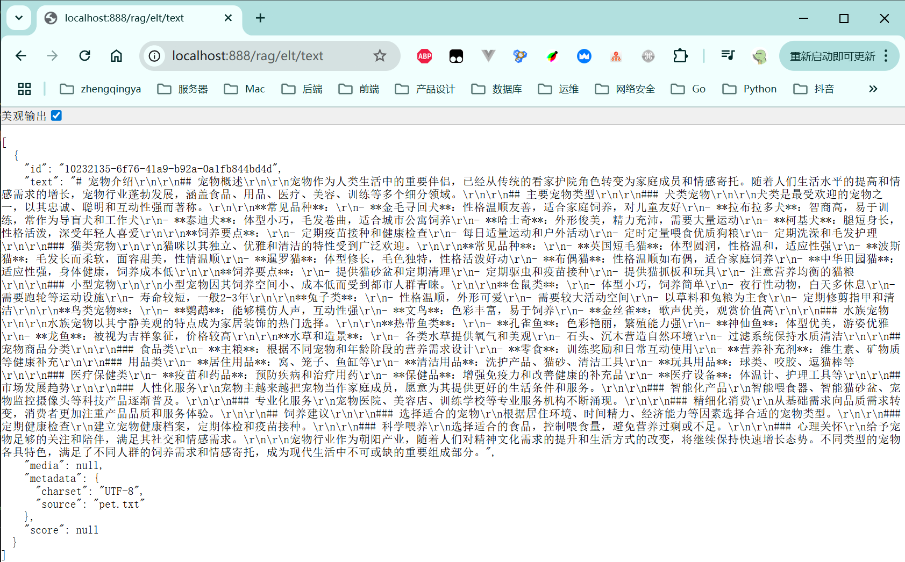
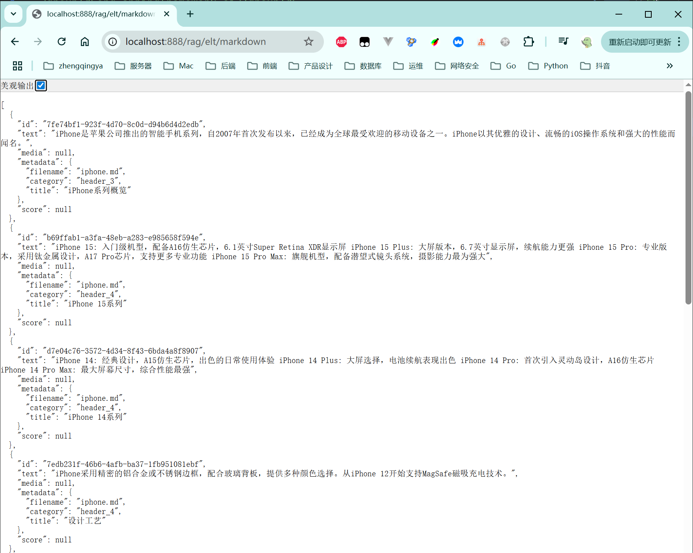

# ELT (Extract, Load, Transform)

> https://docs.spring.io/spring-ai/reference/api/etl-pipeline.html

ELT 是一种数据处理架构模式，包含三个阶段：

1. Extract (抽取): 从各种数据源中提取数据
2. Load (加载): 将原始数据加载到目标数据仓库或数据湖中
3. Transform (转换): 在目标系统中对数据进行清洗、转换和处理

与传统 ETL 的区别

- ETL (Extract, Transform, Load): 先在源系统或中间平台完成数据转换，再加载到目标系统
- ELT (Extract, Load, Transform): 先将原始数据加载到目标系统，利用目标系统的计算能力进行转换

### 一、文本读取器

[_19_RagEltController.java](../01-quick-start/src/main/java/com/zhengqing/saa/api/_19_RagEltController.java)

```java
import org.springframework.ai.document.Document;
import org.springframework.ai.reader.TextReader;

@Value("classpath:rag/pet.txt")
private Resource textRes;

/**
 * 文本读取器
 * http://localhost:888/rag/elt/text
 */
@GetMapping("/text")
public Object text() {
    // 1. 创建文本读取器
    TextReader textReader = new TextReader(textRes);
    // 2. 读取文档内容
    List<Document> documents = textReader.read();
    // 3. 返回结果
    return documents;
}
```



### 二、markdown读取器

[_19_RagEltController.java](../01-quick-start/src/main/java/com/zhengqing/saa/api/_19_RagEltController.java)

```
<dependency>
    <groupId>org.springframework.ai</groupId>
    <artifactId>spring-ai-markdown-document-reader</artifactId>
</dependency>
```

```java
import org.springframework.ai.document.Document;
import org.springframework.ai.reader.markdown.MarkdownDocumentReader;
import org.springframework.ai.reader.markdown.config.MarkdownDocumentReaderConfig;

@Value("classpath:rag/iphone.md")
private Resource MdRes;

/**
 * markdown读取器
 * http://localhost:888/rag/elt/markdown
 */
@GetMapping("/markdown")
public Object markdown() {
    // 1. 创建Markdown文档读取器
    MarkdownDocumentReader markdownReader = new MarkdownDocumentReader(MdRes, MarkdownDocumentReaderConfig.builder()
            // 添加额外的元数据信息，将文件名作为metadata存储在生成的Document对象中
            .withAdditionalMetadata("filename", MdRes.getFilename())
            // 设置是否将水平线(---)作为文档分割符，默认为true，设为false时表示不创建水平线分割的独立文档
            .withHorizontalRuleCreateDocument(false)
            // 设置是否包含代码块内容，设为false表示读取时排除Markdown中的代码块部分
            .withIncludeCodeBlock(false)
            // 设置是否包含引用块内容，设为false表示读取时排除Markdown中的引用块部分
            .withIncludeBlockquote(false)
            .build());
    // 2. 读取Markdown文档内容
    List<Document> documents = markdownReader.read();
    // 3. 返回文档列表
    return documents;
}
```


