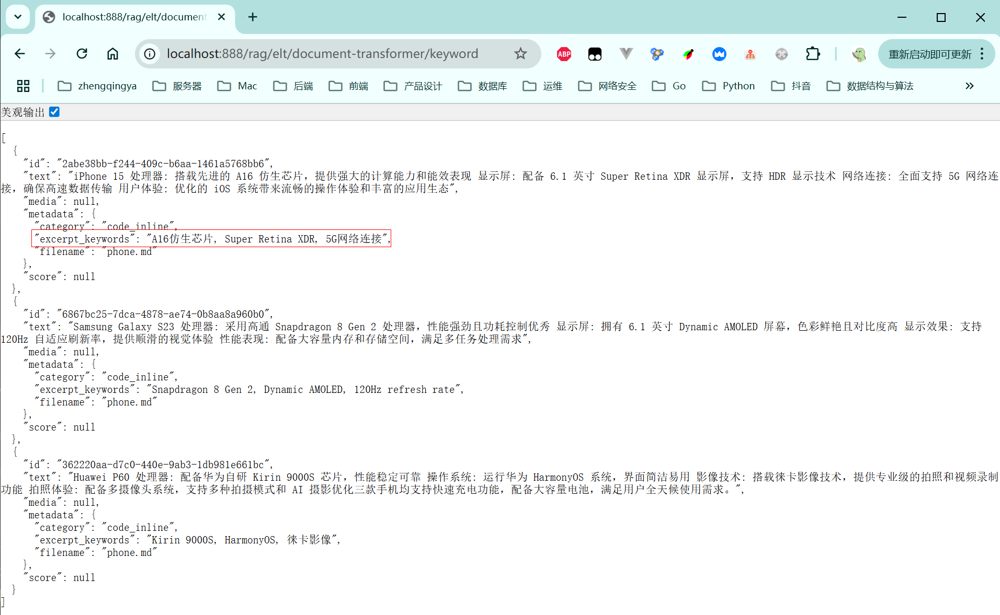

### KeywordMetadataEnricher 文档关键字提取

`KeywordMetadataEnricher` 是 Spring AI Alibaba 提供的元数据增强器，用于自动从文档内容中提取关键字并添加到文档的元数据中。

[_22_RagEltDocumentTransformerController.java](../01-quick-start/src/main/java/com/zhengqing/saa/api/_22_RagEltDocumentTransformerController.java)

```java
import org.springframework.ai.reader.markdown.MarkdownDocumentReader;
import org.springframework.ai.reader.markdown.config.MarkdownDocumentReaderConfig;
import org.springframework.ai.model.transformer.KeywordMetadataEnricher;

@Value("classpath:rag/phone.md")
private Resource MdRes;

@GetMapping("/keyword")
public Object keyword() {
    // 1. 创建Markdown文档读取器
    MarkdownDocumentReader markdownReader = new MarkdownDocumentReader(MdRes, MarkdownDocumentReaderConfig.builder()
            .withAdditionalMetadata("filename", MdRes.getFilename())
            .build());
    // 2. 读取文档内容
    List<Document> documents = markdownReader.read();
    // 3. 关键字提取
    KeywordMetadataEnricher enricher = new KeywordMetadataEnricher(chatModel, 3);
    List<Document> enricherDocs = enricher.apply(documents);
    return enricherDocs;
}
```

效果：

