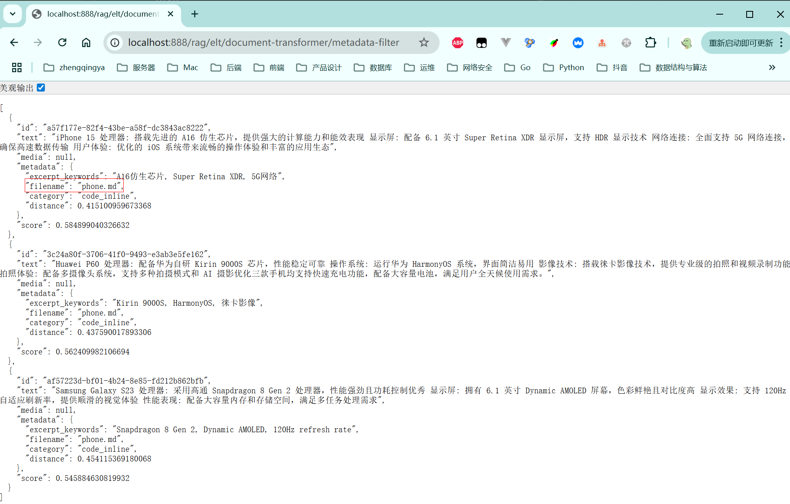

### FilterExpressionBuilder Metadata元数据过滤

基于元数据的过滤条件 `.filterExpression(new FilterExpressionBuilder().eq("filename", "xxx").build())`

[_22_RagEltDocumentTransformerController.java](../01-quick-start/src/main/java/com/zhengqing/saa/api/_22_RagEltDocumentTransformerController.java)

```java
import org.springframework.ai.model.transformer.KeywordMetadataEnricher;
import org.springframework.ai.reader.markdown.MarkdownDocumentReader;
import org.springframework.ai.reader.markdown.config.MarkdownDocumentReaderConfig;
import org.springframework.ai.vectorstore.filter.FilterExpressionBuilder;

@Value("classpath:rag/phone.md")
private Resource MdRes;

@GetMapping("/metadata-filter")
public Object metadataFilter() {
    // 1. 创建Markdown文档读取器
    MarkdownDocumentReader markdownReader = new MarkdownDocumentReader(MdRes, MarkdownDocumentReaderConfig.builder()
            .withAdditionalMetadata("filename", MdRes.getFilename())
            .build());
    // 2. 读取文档内容
    List<Document> documents = markdownReader.read();
    // 3. 关键字提取
    KeywordMetadataEnricher enricher = new KeywordMetadataEnricher(chatModel, 3);
    List<Document> enricherDocs = enricher.apply(documents);
    // 4. 存储向量
    vectorStore.add(enricherDocs);
    // 5. 相似性搜索
    List<Document> result = vectorStore.similaritySearch(SearchRequest.builder()
            .query("手机处理器")
            .topK(3)
            // 基于元数据的过滤条件
//                .filterExpression("filename=='phone.md'")
            .filterExpression(new FilterExpressionBuilder().eq("filename", "phone.md").build())
            .build());
    // 6. 返回结果
    return result;
}
```

效果：

