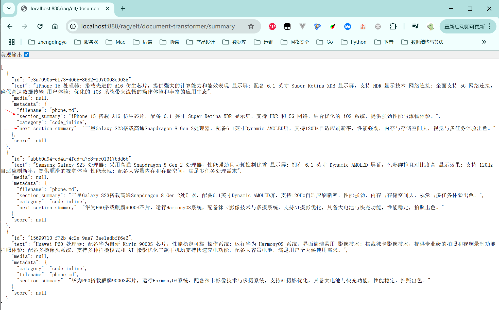

### SummaryMetadataEnricher 摘要生成

利用 AI 模型为文档生成摘要，并将其存储为元数据。

[_22_RagEltDocumentTransformerController.java](../01-quick-start/src/main/java/com/zhengqing/saa/api/_22_RagEltDocumentTransformerController.java)

```java
import org.springframework.ai.model.transformer.SummaryMetadataEnricher;

@Value("classpath:rag/phone.md")
private Resource MdRes;

@GetMapping("/summary")
public Object summary() {
    // 1. 创建Markdown文档读取器
    MarkdownDocumentReader markdownReader = new MarkdownDocumentReader(MdRes, MarkdownDocumentReaderConfig.builder()
            .withAdditionalMetadata("filename", MdRes.getFilename())
            .build());
    // 2. 读取文档内容
    List<Document> documents = markdownReader.read();
    // 3. 摘要生成
    SummaryMetadataEnricher enricher = new SummaryMetadataEnricher(chatModel,
            // 指定要生成的摘要类型，这里包括当前文档和下一部分的摘要。
            List.of(SummaryMetadataEnricher.SummaryType.CURRENT, SummaryMetadataEnricher.SummaryType.NEXT),
            // 使用自定义提示模板
            """
                            请为以下文档内容生成摘要:
                            {context_str}
                    
                            要求:
                            1. 摘要长度不超过100字
                            2. 突出关键信息
                            3. 保持原意不变
                    """,
            // 生成摘要时使用所有元数据
            MetadataMode.ALL);
    List<Document> enricherDocs = enricher.apply(documents);
    return enricherDocs;
}
```

效果:

