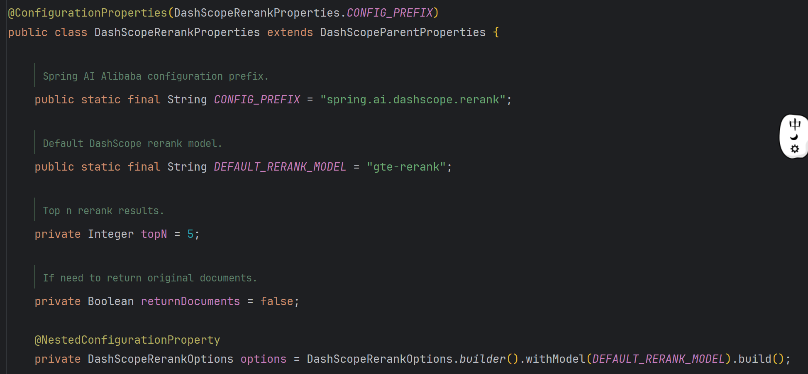

# RetrievalRerankAdvisor 重排序

> tips: 选择一个性能好的模型，不存在乱排序的概率，则不用重排序。

通过引入专门的重排序模型，对检索到的文档进行重新排序，提升最相关文档的排名。
它能够有效提升输入大模型的上下文质量，是构建高准确度、高可靠性问答系统、客服机器人或知识库应用的关键优化手段。

1. 粗排可以设置大一点的topK，获取更多的文档，避免由于部分模型结果不准确，导致丢失最正确的结果。
2. 精排可以使用默认topN(5)

重排序配置参数见 `com.alibaba.cloud.ai.autoconfigure.dashscope.DashScopeRerankProperties`


### 使用示例

[_24_RerankController.java](../01-quick-start/src/main/java/com/zhengqing/saa/api/_24_RerankController.java)

```java
import com.alibaba.cloud.ai.advisor.RetrievalRerankAdvisor;
import com.alibaba.cloud.ai.dashscope.chat.DashScopeChatModel;
import com.alibaba.cloud.ai.dashscope.embedding.DashScopeEmbeddingModel;
import com.alibaba.cloud.ai.dashscope.rerank.DashScopeRerankModel;
import com.alibaba.cloud.ai.model.RerankModel;
import com.google.common.collect.Lists;
import io.swagger.v3.oas.annotations.tags.Tag;
import lombok.extern.slf4j.Slf4j;
import org.springframework.ai.chat.client.ChatClient;
import org.springframework.ai.chat.client.advisor.SimpleLoggerAdvisor;
import org.springframework.ai.document.Document;
import org.springframework.ai.vectorstore.SearchRequest;
import org.springframework.ai.vectorstore.SimpleVectorStore;
import org.springframework.ai.vectorstore.VectorStore;
import org.springframework.web.bind.annotation.GetMapping;
import org.springframework.web.bind.annotation.RequestMapping;
import org.springframework.web.bind.annotation.RequestParam;
import org.springframework.web.bind.annotation.RestController;
import reactor.core.publisher.Flux;

@Slf4j
@RestController
@RequestMapping("/rag/rerank")
@Tag(name = "24-重排序")
public class _24_RerankController {

    private RerankModel rerankModel;
    private ChatClient chatClient;
    private VectorStore vectorStore;

    public _24_RerankController(DashScopeChatModel dashScopeChatModel,
                                DashScopeEmbeddingModel dashScopeEmbeddingModel,
                                DashScopeRerankModel dashScopeRerankModel) {
        chatClient = ChatClient.builder(dashScopeChatModel).defaultAdvisors(new SimpleLoggerAdvisor()).build();
        vectorStore = SimpleVectorStore.builder(dashScopeEmbeddingModel).build();
        rerankModel = dashScopeRerankModel;
    }

    /**
     * http://localhost:888/rag/rerank/chat?msg=iphone20价格
     */
    @GetMapping("/chat")
    public Flux<String> chat(@RequestParam String msg) {
        vectorStore.add(Lists.newArrayList(
                Document.builder().text("iPhone18 基础价格: 5999元, 税率: 13%, 运费: 0元").build(),
                Document.builder().text("iPhone20 基础价格: 12999元, 税率: 13%, 运费: 50元").build(),
                Document.builder().text("iPhone10 基础价格: 1299元, 税率: 13%, 运费: 0元").build()
        ));

        // 重排序
        RetrievalRerankAdvisor rerankAdvisor = new RetrievalRerankAdvisor(vectorStore, rerankModel,
                SearchRequest.builder().topK(10).build());

        return chatClient.prompt().user(msg)
                .advisors(rerankAdvisor)
                .stream().content();
    }

}
```

重排序效果可以通过 debug `com.alibaba.cloud.ai.advisor.RetrievalRerankAdvisor.before` 来观察排序前后文档数据。


