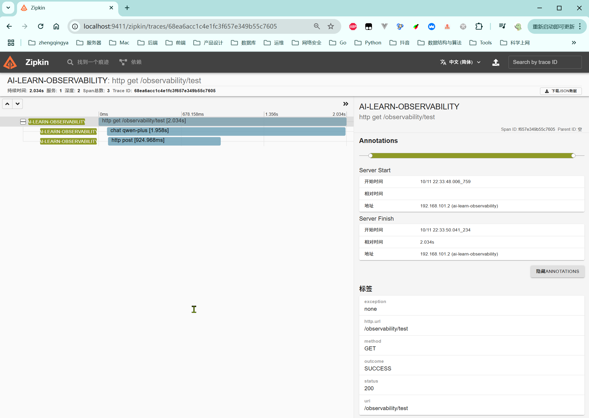

# 可观测

> 参考 https://java2ai.com/docs/1.0.0.2/practices/observability/observability

软件的可观测性（Observability）是指通过系统输出（如日志、指标、跟踪等）来推断其内部状态的能力。
在 Spring AI 中基于 Spring 生态集成可观测性功能。包括 ChatClient（包含 ChatModel 和 Advisor，ToolCall 等） 、EmbeddingModel、ImageModel 和 VectorStore 。

### 一、zipkin部署

参考：https://gitee.com/zhengqingya/docker-compose

### 二、java项目配置

项目见 [04-observability](../04-observability)

#### 1、pom.xml引入依赖

[pom.xml](../04-observability/pom.xml)

```
<dependency>
    <groupId>org.springframework.boot</groupId>
    <artifactId>spring-boot-starter-actuator</artifactId>
</dependency>
<dependency>
    <groupId>com.alibaba.cloud.ai</groupId>
    <artifactId>spring-ai-alibaba-starter-tool-calling-weather</artifactId>
</dependency>
<dependency>
    <groupId>io.micrometer</groupId>
    <artifactId>micrometer-tracing-bridge-brave</artifactId>
    <version>1.5.0-M2</version>
    <exclusions>
        <exclusion>
            <artifactId>slf4j-api</artifactId>
            <groupId>org.slf4j</groupId>
        </exclusion>
    </exclusions>
</dependency>
<dependency>
    <groupId>io.zipkin.reporter2</groupId>
    <artifactId>zipkin-reporter-brave</artifactId>
    <version>3.4.3</version>
</dependency>
```

#### 2、yaml配置

[application-ai-observability.yml](../04-observability/src/main/resources/application-ai-observability.yml)

```yaml
spring:
  ai:
    dashscope:
      api-key: ${AI_DASHSCOPE_API_KEY}
      observations:
        log-completion: true
        log-prompt: true

    # spring ai alibaba weather tool calling config
    alibaba:
      toolcalling:
        weather:
          api-key: ${WEATHER_API_KEY}
          enabled: true

    # Chat config items
    chat:
      client:
        observations:
          # default value is false.
          log-prompt: true
          log-completion: true
          include-error-logging: true

  # tools config items
  tools:
    observability:
      # default value is false.
      include-content: true

    # Image observation is only support openai for spring ai.
    # image:
    #   observations:
    #     log-prompt: true

  http:
    client:
      read-timeout: 60s

management:
  endpoints:
    web:
      exposure:
        include: "*"
  endpoint:
    health:
      # 应用健康状态检查，始终显示详细信息
      show-details: always
  tracing:
    sampling:
      # trace 采样信息，记录每个请求
      probability: 1.0
  zipkin:
    tracing:
      endpoint: http://localhost:9411/api/v2/spans
```

#### 3、测试接口

[ObservabilityTestController.java](../04-observability/src/main/java/com/zhengqing/saa/api/ObservabilityTestController.java)

```java
import com.alibaba.cloud.ai.dashscope.chat.DashScopeChatModel;
import io.swagger.v3.oas.annotations.tags.Tag;
import lombok.extern.slf4j.Slf4j;
import org.springframework.ai.chat.model.ChatModel;
import org.springframework.web.bind.annotation.GetMapping;
import org.springframework.web.bind.annotation.RequestMapping;
import org.springframework.web.bind.annotation.RequestParam;
import org.springframework.web.bind.annotation.RestController;
import reactor.core.publisher.Flux;

@Slf4j
@RestController
@RequestMapping("/observability")
@Tag(name = "可观测性测试")
public class ObservabilityTestController {

    private ChatModel chatModel;

    public ObservabilityTestController(DashScopeChatModel dashScopeChatModel) {
        chatModel = dashScopeChatModel;
    }

    @GetMapping("/test")
    public Flux<String> test(@RequestParam(defaultValue = "你好") String prompt) {
        return chatModel.stream(prompt);
    }

}
```

### 三、测试

1. 请求接口 http://localhost:3888/observability/test?prompt=你是谁？
2. 访问 http://localhost:9411/zipkin/



