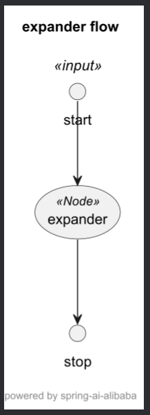
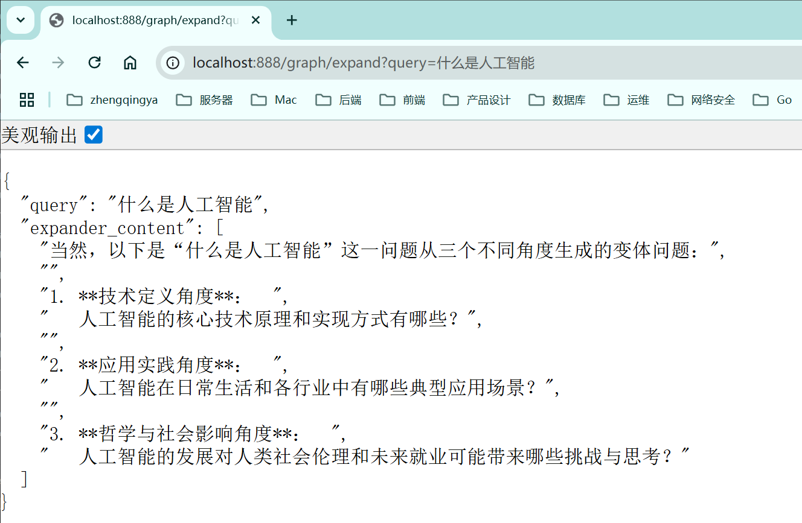

# Spring AI Alibaba Graph 快速入门

Spring AI Alibaba Graph 是一个强大且直观的框架，能让你像搭积木一样，通过编排节点和流程来构建复杂的AI应用。

需求：实现一个问题变体生成器，将输入的问题生成多个变体问题。

#### 1、pom.xml 引入依赖

```
<dependency>
    <groupId>com.alibaba.cloud.ai</groupId>
    <artifactId>spring-ai-alibaba-graph-core</artifactId>
</dependency>
```

#### 2、创建自定义节点

节点是工作的核心单元。这里我们创建一个ExpanderNode，其职责是调用大模型来生成问题变体。

```java
import com.alibaba.cloud.ai.dashscope.chat.DashScopeChatModel;
import com.alibaba.cloud.ai.graph.OverAllState;
import com.alibaba.cloud.ai.graph.action.NodeAction;
import org.springframework.ai.chat.client.ChatClient;

import java.util.Arrays;
import java.util.HashMap;
import java.util.List;
import java.util.Map;

public class ExpanderNode implements NodeAction {
    private final ChatClient chatClient;

    public ExpanderNode(DashScopeChatModel chatModel) {
        this.chatClient = ChatClient.builder(chatModel).build();
    }

    @Override
    public Map<String, Object> apply(OverAllState state) throws Exception {
        // 1. 从全局状态中获取输入
        String query = state.value("query", "");
        // 2. 构建提示词并调用大模型
        String promptTemplate = "请为以下问题生成3个不同角度的变体问题：{query}";
        String result = chatClient.prompt()
                .user(u -> u.text(promptTemplate).param("query", query))
                .call()
                .content();
        // 3. 处理结果（假设结果以换行分隔）
        List<String> queryVariants = Arrays.asList(result.split("\n"));
        // 4. 将结果放入Map，框架会自动将其合并到全局状态中
        Map<String, Object> resultMap = new HashMap<>();
        resultMap.put("expander_content", queryVariants);
        return resultMap;
    }

}
```

#### 3、配置状态图 (StateGraph)

接下来，在配置类中定义工作流的蓝图：有哪些节点，以及它们如何连接。

```java
import com.alibaba.cloud.ai.dashscope.chat.DashScopeChatModel;
import com.alibaba.cloud.ai.graph.GraphRepresentation;
import com.alibaba.cloud.ai.graph.KeyStrategy;
import com.alibaba.cloud.ai.graph.KeyStrategyFactory;
import com.alibaba.cloud.ai.graph.StateGraph;
import com.alibaba.cloud.ai.graph.action.AsyncNodeAction;
import com.alibaba.cloud.ai.graph.state.strategy.ReplaceStrategy;
import lombok.SneakyThrows;
import org.springframework.context.annotation.Bean;
import org.springframework.context.annotation.Configuration;

import java.util.HashMap;

@Configuration
public class SimpleGraphConfiguration {

    @SneakyThrows
    @Bean
    public StateGraph simpleGraph(DashScopeChatModel chatModel) {
        // 全局变量的替换策略（ReplaceStrategy:替换，AppendStrategy:追加）
        KeyStrategyFactory keyStrategyFactory = () -> {
            HashMap<String, KeyStrategy> strategies = new HashMap<>();
            strategies.put("query", new ReplaceStrategy());
            strategies.put("expander_content", new ReplaceStrategy());
            return strategies;
        };
        // 构建状态图
        StateGraph stateGraph = new StateGraph("问题扩展工作流", keyStrategyFactory)
                // 添加节点，并命名为 "expander"
                .addNode("expander", AsyncNodeAction.node_async(new ExpanderNode(chatModel)))
                // 添加边：从开始节点指向 "expander" 节点
                .addEdge(StateGraph.START, "expander")
                // 添加边：从 "expander" 节点指向结束节点
                .addEdge("expander", StateGraph.END);

        // 将图打印出来，可以使用 PlantUML 插件查看
        GraphRepresentation representation = stateGraph.getGraph(GraphRepresentation.Type.PLANTUML, "expander flow");
        System.err.println("\n=== expander UML Flow ===");
        System.err.println(representation.content());
        System.err.println("==================================\n");
        return stateGraph;
    }

}
```

PlantUML 问题扩展流程见 [graph.puml](../01-quick-start/src/main/java/com/zhengqing/saa/api/graph/first/graph.puml)


#### 4、编译并运行工作流

最后，创建一个Controller，将蓝图编译成可执行引擎，并暴露成HTTP接口。

```java
import com.alibaba.cloud.ai.graph.CompiledGraph;
import com.alibaba.cloud.ai.graph.OverAllState;
import com.alibaba.cloud.ai.graph.StateGraph;
import com.alibaba.cloud.ai.graph.exception.GraphRunnerException;
import com.alibaba.cloud.ai.graph.exception.GraphStateException;
import io.swagger.v3.oas.annotations.tags.Tag;
import org.springframework.beans.factory.annotation.Qualifier;
import org.springframework.web.bind.annotation.GetMapping;
import org.springframework.web.bind.annotation.RequestMapping;
import org.springframework.web.bind.annotation.RequestParam;
import org.springframework.web.bind.annotation.RestController;

import java.util.Map;
import java.util.Optional;

@RestController
@RequestMapping("/graph")
@Tag(name = "Graph")
public class SimpleGraphController {

    private final CompiledGraph compiledGraph;

    // 注入定义好的StateGraph，并编译成CompiledGraph
    public SimpleGraphController(@Qualifier("simpleGraph") StateGraph stateGraph) throws GraphStateException {
        this.compiledGraph = stateGraph.compile();
    }

    /**
     * http://localhost:888/graph/expand?query=什么是人工智能
     */
    @GetMapping("/expand")
    public Map<String, Object> expandQuery(@RequestParam String query) throws GraphRunnerException {
        // 设置初始状态，这里传入的"query"会作为工作流的输入
        Map<String, Object> initialState = Map.of("query", query);
        // 执行工作流
        Optional<OverAllState> result = compiledGraph.invoke(initialState);
        // 从最终状态中获取结果
        return result.map(OverAllState::data).orElse(Map.of());
    }

}
```

#### 5、测试

http://localhost:888/graph/expand?query=什么是人工智能

